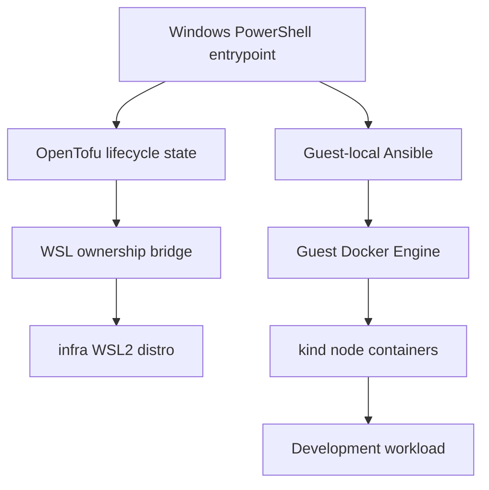
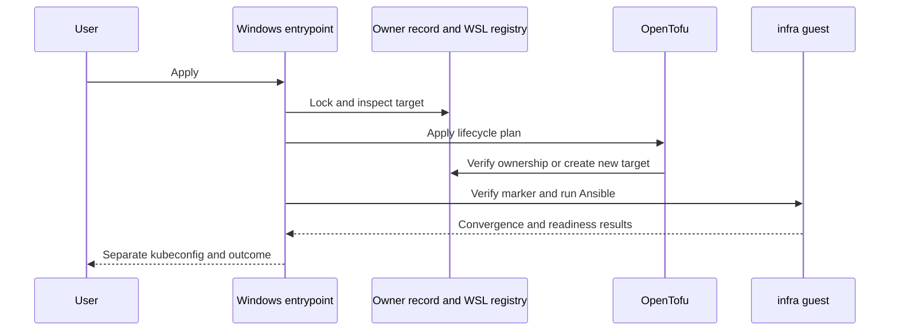
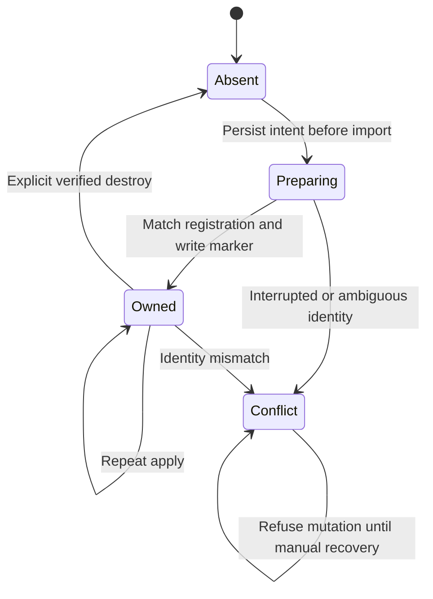

# Windows Local Kubernetes - Plan

이 문서는 `ai-factory`의 최초 Windows 구축 범위다. 프로젝트명만 이전의 `infra`에서
변경했으며, WSL2 배포판·kind 클러스터의 실행 이름은 `infra`로 유지한다.
LiteLLM 배포와 macOS·클라우드 확장은 이 계획의 구현 범위에 추가하지 않는다.

## Goal Capsule

- **Objective:** 개발자가 Windows에서 로컬 Kubernetes에 앱을 배포하고 호스트에서 접근할 수 있다.
- **Means:** OpenTofu와 Ansible로 전용 WSL2 환경과 kind를 구성한다(KTD1–KTD3).
- **Authority:** 사용자 승인과 `AGENTS.md`, Product Contract, Planning Contract 순으로 적용한다.
- **Execution:** 하나의 작성자가 구현하고 독립 검토 후 실제 Windows에서 검증한다. 코드는 로컬 feature branch에 남긴다.
- **Stop conditions:** 기존 배포판 충돌, 소유권 불일치, 해시 불일치, 관리자 권한·전역 WSL 변경 요구가 발생하면 자동 우회하지 않는다.
- **Delivery:** remote 생성·push·PR·merge와 실제 삭제는 이번 실행 범위가 아니다.

---

## Execution Checkpoint — 2026-09-25

- 문서 검토: 다섯 관점의 읽기 전용 검토에서 지적 사항 없음. 서로 다른 모델의 교차 검토는 미실행.
- U1: 구현·오프라인 검사·OpenTofu 정적 검증 및 실제 import 완료. WSL 옵션 인용과
  VHD 디렉터리 SYSTEM ACL 문제를 회귀 검사와 함께 수정했다.
- U2: 실제 Ansible syntax-check/설치/수렴 완료. 두 v1.37.0 노드 Ready, systemd/cgroup v2,
  선언된 도구·패키지 버전을 확인했다.
- U3: **완료.** Windows 인증 API와 샘플 HTTP 200, 반복 Apply `changed=0` 및 동일 ID,
  유휴 유지와 Stop/Start/Apply 후 동일 ID·앱 응답을 검증했다.
- R10을 충족했다. 두 독립 코드 검토에서 차단 사항이 없었다. 전역 변경·실제 삭제는 하지 않았다.
- 초기 실패와 승인된 복구, 기존 기본 배포판의 일시 시작 가능성을 포함한 영향 한계,
  실제 결과와 미검증 범위는 [Windows 검증 기록](../verification/windows-local-kubernetes.md)에 보존한다.

---

## Product Contract

### Summary

전용 `infra` WSL2 배포판에 개발용 Kubernetes를 구축한다.
클러스터와 Linux 설정은 이후 Lima에서도 재사용할 수 있도록 Windows 연결 코드와 분리한다.

### Problem Frame

Windows와 Mac의 개별 설정에 의존하면 앱 개발·배포 환경이 달라진다.
개발 도구 환경과 Kubernetes 환경의 수명주기를 분리해 실험이 기존 개발 환경을 손상시키지 않도록 한다.

### Requirements

**Environment and configuration**

- R1. 별도 `ai-factory` 저장소가 전용 `infra` WSL2 배포판과 그 내부 클러스터를 관리하며 기존 `mds`와 다른 배포판은 변경하지 않는다.
- R2. OpenTofu가 인프라 수명주기를, Ansible이 게스트 구성을 관리하며 불가피한 Windows 연결만 PowerShell로 구현한다.
- R3. 도구·게스트 이미지·Kubernetes 노드 이미지의 고정 버전과 검증 가능한 해시를 선언한다. OS의 전체 전이 패키지 집합까지 동일하다고 보장하지 않는다.
- R4. 반복 apply는 기존 클러스터와 데이터를 유지하며 Ansible을 다시 실행해 원하는 설정에 수렴한다. 호환되지 않는 클러스터 변경은 자동 재생성 대신 중단한다.

**Safety and access**

- R5. 같은 이름의 기존 배포판은 자동 채택하지 않는다. 소유권 기록이 불완전하거나 live 등록 ID가 달라지면 수정·삭제를 중단한다.
- R6. 삭제는 별도 명령의 정확한 대상 확인과 live 소유권 검증을 요구하며 일반 apply는 이를 자동 승인하지 않는다.
- R7. API와 예제 HTTP 서비스는 기본적으로 loopback에만 노출한다. 호스트 kubeconfig는 별도 파일로 저장하고 기존 기본 컨텍스트를 변경하지 않는다.
- R8. 전역 WSL 설정, 기본 배포판, 방화벽, 시스템 PATH를 자동 수정하지 않으며 전체 WSL 종료를 실행하지 않는다.
- R9. state·소유권 정보·kubeconfig·다운로드·개인 경로는 Git에 포함하지 않는다.

**Verification**

- R10. 새 전용 배포판에서 노드 Ready, 샘플 앱 응답, 호스트 접근, 반복 적용을 실제 검증한다. 실제 검증과 mock 검증을 구분한다.

### Key Decisions

- **전용 환경을 기존 개발용 게스트와 분리한다.** Governs R1, R5. (session-settled: user-directed — chosen over existing mds guest reuse: 클러스터 수명주기를 개발 도구·데이터와 분리한다.)
- **Windows부터 실제 구축한다.** Governs R10. (session-settled: user-directed — chosen over code-only delivery: 새 전용 배포판의 실제 동작까지 검증한다.)

### Scope Boundaries

- 이번 target은 Windows amd64, WSL2, Ubuntu LTS와 kind다.
- WSL2 배포판 분리는 별도 하이퍼바이저 VM 격리가 아니다. WSL VM·커널·자원 설정을 공유한다.
- kind 노드는 컨테이너다. 프로덕션 HA·독립 VM 노드·영속 데이터 백업 보장은 범위 밖이다.
- macOS/Lima, GitOps, 공용 ingress, 관측 스택, 클라우드 자원, 원격 저장소 공개는 후속 작업이다.

### Acceptance Examples

- AE1. Covers R4. 정상 환경에 같은 설정을 다시 적용하면 WSL 등록 ID와 kind 노드 ID가 유지되고 Ansible 변경은 수렴한다.
- AE2. Covers R5. `infra` 이름만 같고 소유권 증거가 없는 환경에는 생성·설정·삭제를 수행하지 않는다.
- AE3. Covers R6. 일반 apply가 replacement를 요구하거나 raw destroy가 확인 값 없이 실행되면 배포판 삭제 전에 실패한다.
- AE4. Covers R7, R10. Windows loopback HTTP 요청이 배포한 앱의 예상 응답을 반환한다.

---

## Planning Contract

### Key Technical Decisions

- KTD1. **OpenTofu built-in `terraform_data`와 최소 WSL bridge.** 검증된 first-class WSL provider를 확보하지 못했으므로 WSL CLI를 사용한다. OpenTofu state가 실제 배포판 drift를 자동 탐지한다고 주장하지 않으며 wrapper와 doctor가 live 등록 정보를 확인한다. 생성 후 ID 저장 전 중단은 자동 복구·채택하지 않는다. [OpenTofu terraform_data](https://opentofu.org/docs/language/resources/tf-data/)
- KTD2. **생성과 구성을 분리한다.** OpenTofu 적용 후 Ansible을 매번 실행한다. 매번 timestamp로 인프라 replacement를 만들지 않으며 Ansible 실행을 create-only provisioner에 숨기지 않는다. R2, R4를 구현한다.
- KTD3. **Ubuntu 24.04 LTS amd64, guest-local Ansible, rootful Docker, kind.** Ansible은 Python 가상환경에 설치해 OS Python을 변경하지 않는다. 관리용 명령은 전용 게스트의 root에서 실행한다. 호스트 Docker socket이나 Docker Desktop은 사용하지 않는다. 버전 잠금 파일의 구체 값은 공식 배포물 검증 후 결정한다.
- KTD4. **소유권과 직렬화.** 별도 안정적인 owner ID를 OpenTofu state에 보관하고 host record에 대상 이름·등록 GUID·정규화된 설치 경로·이미지 해시를 결합한다. retry는 같은 owner와 등록 ID에서만 허용한다. 게스트 marker도 구성 전 검증한다. 단일 인스턴스 작업은 OS 파일 잠금으로 직렬화한다. 이는 동일 사용자 악성 행위에 대한 보안 경계가 아닌 오삭제 방지다.
- KTD5. **프로젝트 전용 도구와 상태.** OpenTofu는 checksum 검증 후 Git 제외된 도구 경로에 설치한다. 상태·plan·kubeconfig는 로컬 전용 경로에 저장하고 출력하지 않는다. POSIX 민감 파일은 0600, Windows 로컬 상태는 현재 사용자와 필요한 시스템 주체만 접근하도록 제한한다.
- KTD6. **작은 단일 클러스터.** control-plane 1개와 worker 1개, 고정된 loopback API/HTTP 포트를 사용한다. 기존 cluster 이름·구성 digest를 확인하고 foreign container나 호환되지 않는 설정을 만나면 중단한다. 예제 앱은 명시적인 smoke 명령에서만 배포한다.
- KTD7. **삭제와 교체 제한.** destroy-time provisioner는 R6의 확인 값이 없으면 실패한다. owner ID를 인스턴스 resource ID와 분리해 tainted create의 retry가 잘못된 새 소유권을 만들지 않게 한다. tainted 리소스나 configuration 제거 시 destroy provisioner가 생략될 수 있음을 문서화하고, 기록 없는 live 자원은 자동 채택하지 않는다. [Provisioner caveats](https://opentofu.org/docs/language/resources/provisioners/syntax/)

### High-Level Technical Design

### Risks and Dependencies

- Windows PowerShell 5.1의 native 인자 전달과 UTF-16 WSL 출력은 fake runner와 실제 실행에서 확인한다.
- Ubuntu 이미지·apt·PyPI·GitHub·컨테이너 registry에 접근할 수 있어야 한다. checksum 오류나 네트워크 실패를 성공으로 감추지 않는다.
- WSL localhost forwarding과 호스트 포트 충돌은 실제 실행 시 확인한다. 실패를 해결하려고 방화벽을 열거나 전역 WSL 설정을 바꾸지 않는다.
- clone 이동·state 손실·중단된 import는 자동 채택으로 복구하지 않으며 안전한 수동 진단 경로를 제공한다.

---

## Implementation Units

### U1. Windows lifecycle bridge and OpenTofu contract

- **Goal:** 선언한 전용 배포판만 생성·진단·중지·삭제할 수 있게 한다.
- **Requirements:** R1–R3, R5–R9; KTD1, KTD4, KTD5, KTD7.
- **Dependencies:** 없음.
- **Files:** `infra.ps1`, `scripts/windows/`, `environments/windows/`, `versions.json`, `tests/windows/`, `.gitignore`, `README.md`.
- **Approach:** 공통 파일·버전 계약을 먼저 정의하고 native 실행·상태 판정·소유권 검증을 테스트 가능한 함수로 분리한다. OpenTofu 생성 상태와 live 관측을 혼동하지 않는다.
- **Execution note:** fake WSL/native runner로 보호 경계의 실패를 먼저 관찰한다. 실제 삭제 테스트는 하지 않는다.
- **Patterns:** `AGENTS.md`의 명시적 소유권과 공개 저장소 경계.
- **Test scenarios:**
  1. 새 target 생성과 owned target 재실행이 성공한다.
  2. 같은 이름의 foreign target, 등록 GUID 변경, 설치 경로 변경은 거부한다.
  3. 체크섬 오류와 native nonzero exit는 하위 실행 전에 실패한다.
  4. 불완전 preparing record는 자동 채택하지 않는다.
  5. confirmation 없는 destroy와 apply-triggered replacement는 삭제를 실행하지 않는다.
  6. 공백 경로, UTF-16 목록, 중복 실행 잠금 충돌을 처리한다.
- **Verification:** PowerShell 파싱·오프라인 테스트, OpenTofu fmt/validate가 통과한다.

### U2. Common Ansible and kind environment

- **Goal:** 새 게스트에서 선언한 Kubernetes 개발 환경을 구성한다.
- **Requirements:** R2–R4, R7, R9, R10; KTD2, KTD3, KTD6.
- **Dependencies:** U1.
- **Files:** `ansible/`, `scripts/guest/`, `config/`, `examples/smoke/`, `tests/`, `README.md`.
- **Approach:** checksum 검증한 도구와 잠근 top-level 패키지를 설치하고 systemd/Docker/노드 readiness를 검사한다. Linux 내부 경로에 구성을 복사한 후 Ansible을 실행한다.
- **Execution note:** 구성 코드에는 문법·정적 계약 검사와 실제 smoke를 우선한다. 테스트가 패키지 관리자 동작을 입증한다고 주장하지 않는다.
- **Test scenarios:**
  1. 지원하는 OS에서 Docker와 두 kind 노드가 준비된다.
  2. 기존 클러스터와 같은 설정은 유지되고 설정 불일치는 자동 삭제 없이 실패한다.
  3. kubeconfig 권한과 loopback 바인딩을 검사한다.
  4. smoke 앱은 명시 실행 때만 생성되며 반복 실행은 안전하다.
- **Verification:** Ansible syntax-check, 첫 적용, 반복 적용, 노드 Ready와 앱 응답 확인.

### U3. Actual Windows validation and operator handoff

- **Goal:** Windows에서 실제 동작과 제한을 확인해 사용할 수 있게 인계한다.
- **Requirements:** R4–R10; AE1–AE4.
- **Dependencies:** U1, U2.
- **Files:** `README.md`, `docs/verification/windows-local-kubernetes.md`.
- **Approach:** 승인된 새 `infra` target만 사용한다. 기존 배포판의 등록 ID·상태와 전역 설정을 전후 비교한다. API 인증정보나 개인 경로를 evidence에 기록하지 않는다.
- **Test scenarios:**
  1. Windows 호스트에서 샘플 HTTP 요청이 성공한다.
  2. 두 번째 apply 뒤 같은 배포판·노드가 유지된다.
  3. 기존 배포판 상태와 전역 WSL 설정이 보존된다.
  4. 독립 리뷰의 수정 후 오프라인 검사와 필요한 live smoke를 다시 실행한다.
- **Verification:** 실제 결과·미실행 항목·복구 절차를 분리해 기록한다.

---

## Verification Contract

| Gate | Unit | Required evidence |
| --- | --- | --- |
| PowerShell AST parse and offline safety suite | U1 | `powershell.exe -NoProfile -File tests/windows/Run-Tests.ps1` 성공, 실제 WSL mutation 없음 |
| OpenTofu formatting and validation | U1 | `tofu fmt -check -recursive`, 초기화 후 `tofu validate` 성공 |
| Ansible syntax | U2 | guest 가상환경의 `ansible-playbook --syntax-check` 성공 |
| Actual apply and readiness | U2 | 선언 버전, Docker readiness, Kubernetes 노드 Ready |
| Host smoke and repeat convergence | U3 | loopback HTTP 응답, 동일 노드 ID, 반복 Ansible 변경 수 |
| Scope and privacy | U1–U3 | 기존 배포판·전역 설정 유지, Git 제외 확인, 민감정보 없는 diff |

## Definition of Done

- U1: 오프라인 보호 경계와 OpenTofu 정적 검증이 통과한다.
- U2: 실제 전용 게스트에서 선언 구성이 준비되고 반복 적용이 수렴한다.
- U3: Windows 호스트에서 앱을 확인하고 검증 기록과 운영 절차를 남긴다.
- 독립 검토에서 확인된 차단 결함을 수정하고 관련 검증을 다시 수행한다.
- 버려진 시도나 임시 코드는 source diff에 남기지 않는다.
- 미검증 destroy·macOS·전체 OS 재현성을 검증 완료로 표현하지 않는다.
